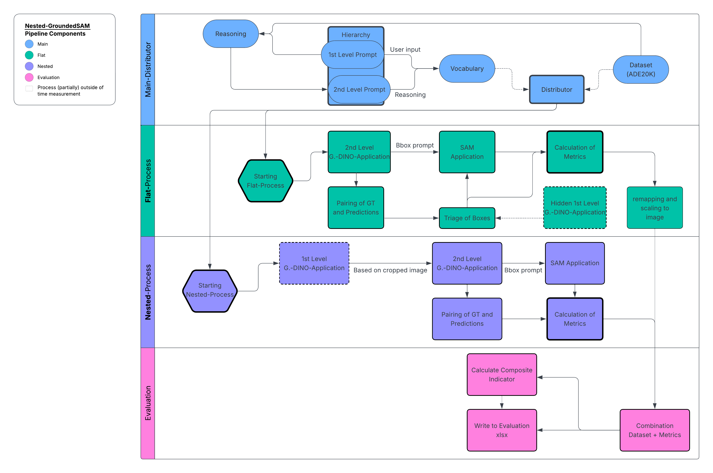
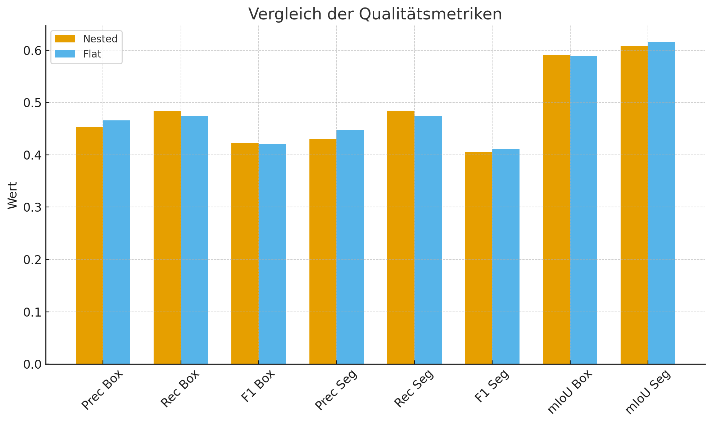

# Nested-GroundedSAM  
Hierarchical Segmentation of Nested Objects in Complex Outdoor Scenes  

## 📖 Overview  
This repository contains the implementation of **Nested-GroundedSAM**, a hybrid modular pipeline for open-set object detection and segmentation.  
The project extends **GroundedSAM** by introducing a **hierarchical strategy**:  
- Large, enclosing objects (e.g., building facades) are detected first.  
- Sub-objects (e.g., windows, doors) are then identified within these regions.  

The goal is to evaluate whether such a hierarchical prompt strategy improves detection and segmentation performance in complex outdoor scenes, compared to the flat reference approach.  

## 🔍 Motivation  
Standard zero-shot segmentation models like **GroundedSAM** struggle with **nested and overlapping objects**, e.g., windows in buildings or wheels on vehicles.  
By focusing detection on context-specific subregions, Nested-GroundedSAM aims to:  
- Reduce background noise.  
- Improve recall for small or occluded objects.  
- Enable semantic evaluation across multiple hierarchy levels.  

## 🏗️ Methodology  
The pipeline consists of four main components:  
1. **Distributor**  
   - Iterates over ADE20K dataset instances.  
   - Manages vocabulary for flat and nested prompts.  
   - Supports manual prompt definition and automated prompt reasoning with an LLM.  

2. **Reference Approach (Flat)**  
   - Implements a restructured GroundedSAM pipeline.  
   - Uses a single global prompt for direct object detection.  

3. **Nested-GroundedSAM**  
   - Introduces hierarchical detection.  
   - First detects enclosing objects (e.g., building).  
   - Recursively searches for sub-objects (e.g., window).  
   - Includes coordinate transformations to align Grounding DINO and SAM outputs.  

4. **Evaluation System**  
   - Computes metrics (Precision, Recall, F1, mIoU).  
   - Aggregates results with a **Composite Indicator** (Distance-P2 method).  
   - Records runtime and outputs structured JSON logs.  

<p align="center">  
    
</p>  

## 📊 Evaluation  
- Dataset: **ADE20K** (300 instances, class: `building_facade`).  
- Metrics: Precision, Recall, F1, mIoU, Composite Indicator.  
- Statistical tests: **Wilcoxon Signed-Rank**, **Pearson correlation**.  

**Results (summary):**  
- Nested-GroundedSAM does **not show significant overall improvements** in classical metrics.  
- Trade-off observed:  
  - Slightly **higher recall** (more true positives).  
  - Slightly **lower precision** (more false positives).  
- Runtime:  
  - Flat: ~614 ms per instance.  
  - Nested: ~636 ms per instance (+3.6%).  
  - Nested (cropped input): ~559 ms (-9%).  

<p align="center">  
    
</p>  

## ⚙️ Installation & Usage  

### Prerequisites  
- Python 3.10+  
- PyTorch ≥ 2.0  
- CUDA-compatible GPU (recommended)  
- Jupyter Notebook (for prototype development)  

### Setup  
```bash
git clone https://github.com/MikaDinnus/nested-grounded-sam.git
cd nested-groundedsam
```

### Run
Use the main.py to define the vocab and run the pipeline. Be aware, that a Microsoft Azure Computer Vision API and Gemini API Key is needed to run the reasoning part. It is possible to disable this part by defining the vocab by hand in main.py
 
All evaluations will be stored in structured JSON logs for reproducibility.  

## 🚀 Future Work  
- Improve **upsampling methods**, as rescaling introduces artifacts.  
- Optimize runtime by integrating **EfficientSAM** backbones (distilled ViT encoders).  
- Extend experiments to **multiple ADE20K classes** beyond facades.  
- Explore tighter coupling with LLM reasoning for **context-aware prompt generation**.  

## 📚 Citation  
If you use this project, please cite:  

```bibtex
@thesis{dinnus2025nested,
  title     = {Hierarchical Segmentation of Nested Objects in Complex Outdoor Scenes with GroundedSAM},
  author    = {Mika Frederic Dinnus},
  school    = {University of Münster},
  year      = {2025},
  type      = {Bachelor's Thesis}
}
```

## 🙏 Acknowledgements  
- [Grounding DINO](https://github.com/IDEA-Research/GroundingDINO)  
- [Segment Anything Model (SAM)](https://github.com/facebookresearch/segment-anything)  
- ADE20K dataset by [MIT CSAIL](https://groups.csail.mit.edu/vision/datasets/ADE20K/).  
- Supervision: Prof. Dr. Benjamin Risse, University of Münster.  

---
